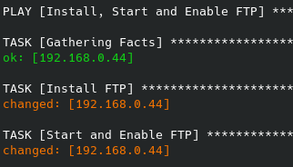
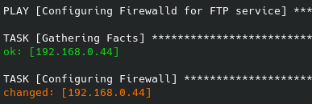
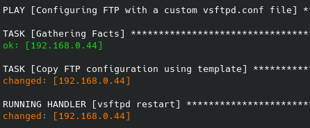
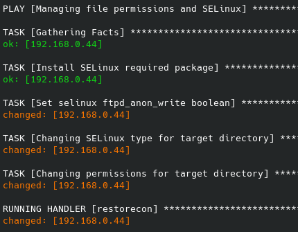
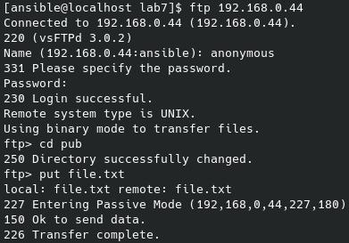
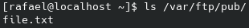

# Configuring an FTP server with Ansible

The purpose of this project is to automate the configuration of an FTP server (vsftpd) using Ansible. The ansible playbook will cover the following:
* FTP service configuration. The vsftpd.conf will be generated through Jinja 2. When using templates, the target files are automatically customized using variables and facts
* Firewall Rules
* Systemctl configuration
* SELinux permissions

At the end of the playbook execution, it should be possible to transfer files through the anonymous user

## Hands On

Note: This lab was performed on a CentOS 7.

The playbook is divided into 4 plays

* The first play is responsible for installing, starting and enabling the ftp service on the system.

  

* The second play contains the task that configures the firewall to allow ftp connections.

  

* The third play configures the FTP service. For this, the configuration file is built using a template (Jinja 2). The handler guarantees that after executing the tasks of this play with changes, the ftp service is restarted to receive the new settings.

  

* The last play install and configures SELinux permissions to allow user anonymous and writing to the necessary directories.

  

## Testing

Commands:
* `ftp <remote IP>`
* `anonymous`
* `<enter>`
* `cd pub`
* `put file.txt`

  

As we can see below, the file was successfully uploaded!

  

